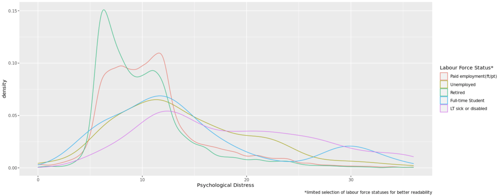
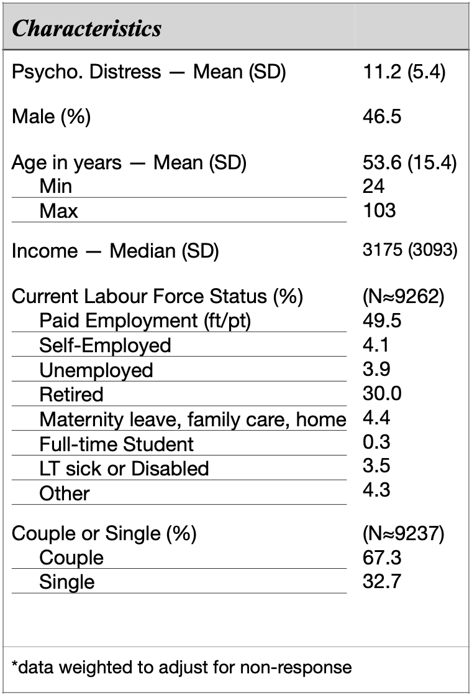
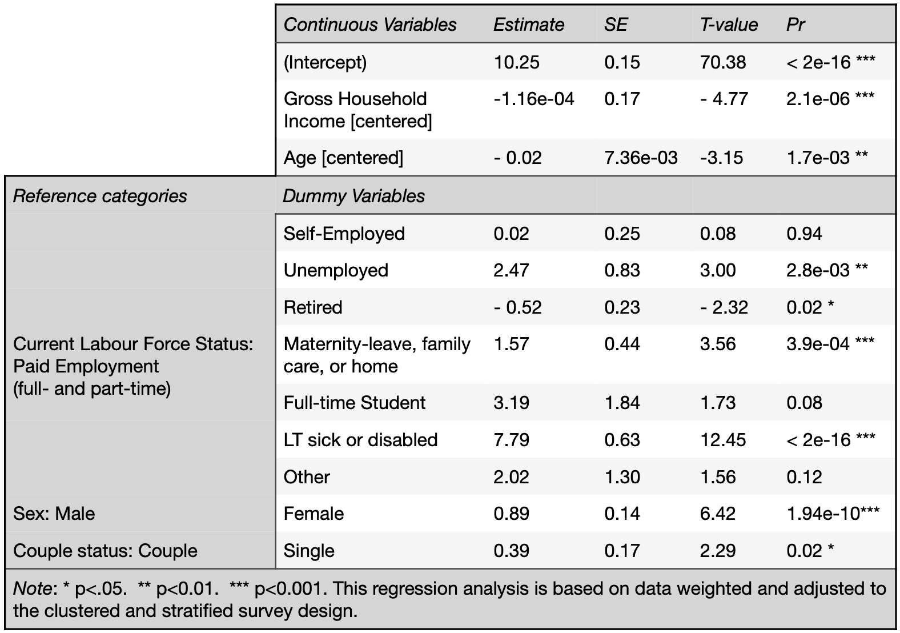
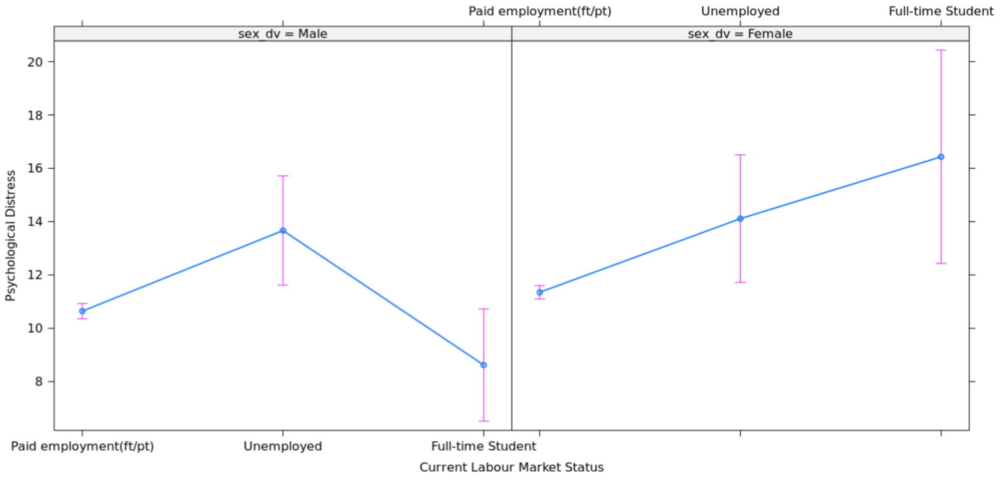

# The Effects of Current Job Status on Subjective Wellbeing

Research has highlighted striking effects of economic disadvantage on both mental and physical health. Experiencing persistent hardship increases the risk of depression, obesity, and diabetes (Everson et al., 2002) and the scarring effect of unemployment has been proven (Clark et al., 2001). This report attempts to provide evidence of the association between labour force status and wellbeing in the UK, with a particular focus on the potential negative effects of unemployment or inability to work. It will also inspect potential gender discrepancies, as discriminatory social norms also affect women’s labour force participation (Jütting et al., 2008). The hypothesis tested is that being unemployed is correlated with higher psychological distress.

### Study Design

This report uses data from the ninth wave 2017-2018) of Understanding Society’s Longitudinal Teaching Dataset which combines the responses from adult (16+) interviews from the General Population and Ethnic Minority Boost samples. The former is a multi-stage clustered and stratified probability sample that includes approximately 24,000 households in the UK. The Boost Samples add 6,200 households selected from areas of high ethnic minority concentration.

## Measures

#### Outcome Variable: Subjective Wellbeing
Respondents were asked 12 questions from the General Health Questionnaire (GHQ), a psychometric tool to detect psychological morbidity. The measure of psychological distress used as the dependent variable in this report converts the answers into a scale running from 0 (least distressed) to 36 (most distressed).

#### Explanatory Variable: Current Labour Force Status
Respondents were originally grouped into 12 categories that best described their current economic activity. Because of the specific focus of this report, some of the categories were collapsed, resulting into 8 categories (Table 1).

#### Defining the Covariates
Partial F-tests and model comparisons using the Akaike information criterion (AIC) guided the selection of covariates in the final model.

Variables that did not improve the explanatory power of the regression model and/or whose relationship with the outcome variable could not be theoretically justified were eliminated.

Information about gender was collected as a binary variable by Understanding Society’s survey. Both age and gross national income covariates were centered around their mean. It should be noted that income is positively skewed, however, transforming the variable did not improve the model enough to justify the process.

*Fig. 1 - Distribution of the Levels of Psychological Distress Across Labour Force Statuses*

### Statistical Analysis

Based on the large size of the sample and the unlikeliness of any consequential item non- response, imputation was deemed unnecessary. Questions deemed “too sensitive for an individual to be able to comfortably answer in front of the interviewer” (2020: 3) such as those at the basis of the variable for subjective wellbeing, were included in a separate self-completion. Therefore, the data was adjusted for survey non-response using adult self- completion interview weight. The complex survey design, including both stratification and clustering, was also taken into account using a survey design object.

*Table 1. Characteristics of Respondents of the Complete Case Study Sample (N≈9268.5)*

## Results

The sample has a slight majority of women, and the average age in years is 53.6. The standard deviation of 15.4 for this variable suggests an important dispersion in terms of ages. The mean income (£3,997) is pushed up by high values (max income is £131,881.7). Almost half the respondents of the survey are in a situation of paid employment, and another 30% are retired. Full-time students make up the smallest labour force status group of the sample with 0.3%.

### Findings of the multiple linear regression

*Table 2. Multiple Regression Analysis Predicting Psychological Distress*

The model predicts a GHQ score of 10.25 for a 54 years old woman in a situation of paid employment with a gross household income of £3.997. Both women and single respondents have statistically significant higher values of psychological distress than their counterparts, holding labour force status, age and income constant. Inversely, age and gross household income are negatively correlated with psychological distress. Increasing income by one unit while holding the other variables constant leads to a 0.00016 decrease on the GHQ scale, and therefore a better wellbeing.

Four of the seven labour force statuses display a statistically significant relationship with psychological distress. While controlling for other variables, unemployment, maternity-leave or family care, and long-time sickness or disability are associated with worse subjective wellbeing compared to paid employment. Being unemployed is related to a 2.47 points jump on the scale of psychological distress compared to being employed. This finding provides evidence to confirm the hypothesis tested by the report.

On the other hand, retired people score lower in psychological distress than people in paid employment by a slight but statistically significant margin of 0.52. High p-values for the relationships between psychological distress and being a student or self-employed prevent the null hypothesis from being rejected; therefore, what seemed to be a decrease of subjective wellbeing associated to being a student compared to being employed cannot be declared statistically significant.

### Interaction between sex and labour force status in relations to subjective well being

Fitting a regression model predicting psychological distress including an multiplicative term between sex and labour force status does not uncover a statistically significant interaction for unemployed people; however, the positive relationships between being a student and psychological distress is significantly stronger for women than from men (Figure 2).

*Figure 2, The Influence of Sex on the Impact of Being a Student on Psychological Distress*

## Conclusions

As predicted, being unemployed is correlated with psychological distress. Reasons for unemployment potentially causing worse wellbeing could be advanced; however, this is outside the scope of this report. Other findings include a gender discrepancy and a positive correlation between household income and wellbeing. A difference in psychological distress between students and people in situation of paid employment could not be demonstrated; on the contrary of a significant interaction effect leading wellbeing to differ over being a student for men compared with women.

### Limitations

First, the outcome variable measures ‘subjective wellbeing’ using a twelve-question, self- completed questionnaire. The quality of the GHQ as a measure of psychological distress can be questioned (Hankins, 2008); and the data collection method could be subject to bias and error on the part of respondents, leading to measurement error.

Second, the linear regression itself has flaws. The number of variables predicting the GHQ-12 score is limited, as indicated by the adjusted r- squared of 11% that could suggest a potentially consequential omitted variable bias. Moreover both income and subjective well-being were positively skewed, breaking an assumption of regression.

--- 

## Bibliography

Clark, A., Georgellis, Y., & Sanfey, P. (2001). Scarring: The psychological impact of past unemployment. Economica, 68(270), 221-241.

Clark, A. E. (2003). Unemployment as a social norm: Psychological evidence from panel data. Journal of labor economics, 21(2), 323-351.

Everson, S. A., Maty, S. C., Lynch, J. W., & Kaplan, G. A. (2002). Epidemiologic evidence for the relation between socioeconomic status and depression, obesity, and diabetes. Journal of psychosomatic research, 53(4), 891-895.

Goldberg DP, Williams P (1988). A user's guide to the General Health Questionnaire. Basingstoke NFER-Nelson

Hankins, M. (2008). The reliability of the twelve-item general health questionnaire (GHQ-12) under realistic assumptions. BMC public health, 8(1), 1-7.

Jütting, J. P., Morrisson, C., Dayton-Johnson, J., & Drechsler, D. (2008). Measuring gender (in) equality: The OECD gender, institutions and development data base. Journal of Human Development, 9(1), 65-86.

Lynn, P. (2009). Sample design for understanding society. Underst. Soc. Work. Pap. Ser, 2009.

Lynn, P, Berthoud, R., Fumagalli, L., & Platt, L. (2009). Design of the Understanding Society ethnic minority boost sample. 
Colchester: Institute for Social and Economic Research, University of Essex (Understanding Society Working Paper 2009-02).

University of Essex. Institute for Social and Economic Research. (2020). Understanding Society: Longitudinal Teaching Dataset, Waves 1-9, 2009-2018. [data collection]. 1st Edition. UK Data Service. SN: 8715, http://doi.org/10.5255/UKDA-SN- 8715-1